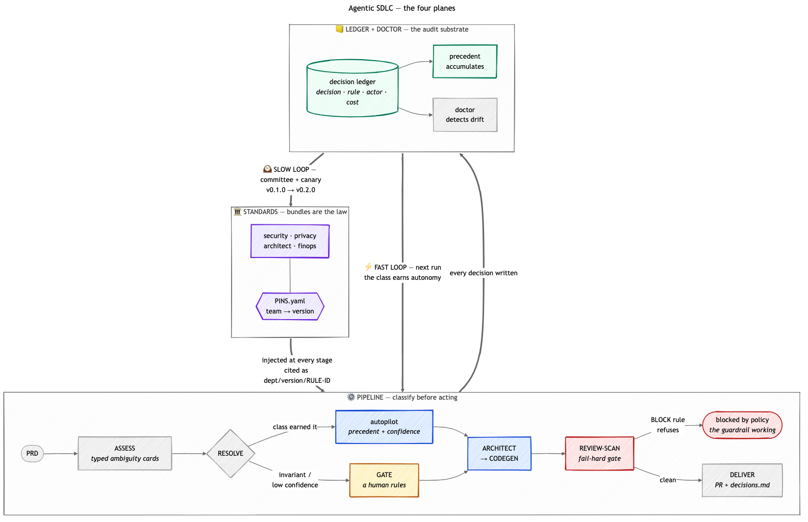

# Concept Brief — Governed AI Development, as an operating model
_Customer-facing. For a COE / AI-center leader at an HLS enterprise. One read, ~5 min._
_Working name deferred. Substrate referred to here as "the Decision Record."_

---

## The problem you actually have

You are being asked to set a strategic direction for how your organization
develops software WITH AI. Not a tool decision — a governance decision. Because
the moment your teams adopt Copilot, coding agents, and PRD-to-PR pipelines, you
inherit a question your compliance function cannot answer today:

> "An AI agent made a decision that shipped to production. Which policy governed
> that decision, who approved it, what did it cost, and can you prove it?"

Your existing stack tells you WHAT happened. GitHub audit shows the PR. Purview
shows the data lineage. Foundry shows the model usage and spend. None of them
capture WHY the AI chose the path it did, bound to the specific version of YOUR
policy that was in force at that moment. That gap is where shadow-AI risk lives,
and it grows with every team that adopts.

## The idea in one sentence

A governed operating model for AI-assisted development: your standards become
versioned code, every AI decision writes an auditable record of its reasoning
bound to the rule that governed it, the cost of that decision is attributed to
the team that made it, and a drift-watcher proposes updates to your rules as the
system learns — all configured by you, running on your Azure.

## How it is shaped — two planes

**Data plane** — where AI does the work. A PRD-to-PR pipeline, IDE Copilot,
coding agents, chat bridges. This is swappable. Bring your own. If you have a
codegen approach you like, keep it — the value is not here.

**Control plane** — how you govern it. Four capabilities:

1. **Standards as code.** Each department authors its own rules as versioned,
   PR-reviewed policy — not a wiki, not tribal knowledge. Changing a rule is a
   pull request with a required reviewer roster. PHI rules are hard-locked.

2. **The Decision Record.** Every meaningful AI decision — from the pipeline,
   from an IDE session, from a coding agent — writes one immutable entry:
   what was decided, the full rationale, the exact policy rule that governed it,
   the human or agent identity behind it, the PHI classification, the model used,
   and the cost. One query surface across every AI surface. This is the substrate
   compliance reads. It is the point of the whole system.

3. **Cost economics.** Cost is attributed per DECISION, not per token, and rolled
   up to the team and cost-center that owns it — in your accounting vocabulary,
   not ours. The hard-savings line and the cost-avoidance line map to categories
   your CFO already uses.

4. **The Drift Doctor.** Reads the Decision Record continuously and watches for
   five signals — autopilot rejections climbing, cost per decision climbing,
   ambiguity classes with no governing rule, unused rules, PHI-classification
   violations. For each it either applies a fix WITHIN a policy envelope you
   defined, or opens a standards-change PR for your committee. It never relaxes a
   PHI rule on its own. Ever.

## What you configure — this is the product

The system is not a fixed demo. It is a surface where YOU instantiate your
governed operating model, without writing code:

- **Your organization** — departments, teams, cost centers, reviewer rosters,
  and the mapping to your Entra/M365 identities.
- **Your standards** — author and version your own rules per department.
- **Your autonomy policy** — for each class of decision, per team, you set how
  much you trust AI: always gate to a human, autopilot above a confidence
  threshold, or full autopilot. PHI-classification and auth-policy are locked to
  human gate and cannot be opened. This matrix IS your AI-adoption strategy,
  expressed as configuration.
- **Your model policy** — which models are approved, which are banned, which are
  cleared for PHI-adjacent work, how they route per stage, and your cost ceilings.

## The one thing to judge us on

Forget the pipeline. Forget the dashboard. The acceptance test is a single query:

> "Show me every AI decision made on PHI-classified data in the last 30 days —
> the rule that governed each one, whether a human or an agent decided, and what
> it cost."

If that returns complete, real, cross-surface rows, you have a governed AI
operating model. If it can't, you have a demo. Everything else in this system
exists to make that query true.

**On the live system today that query returns 38 rows, and every one of them was
decided by a human — zero by the agent.** Not because the agent was
unavailable, but because `phi-classification` is an invariant class the autonomy
matrix cannot open. That is the difference between a policy you assert and a
policy that holds.

## The number that proves the guardrails bite

Governance is easy to claim and hard to evidence. Here is the evidence, from the
live system, stated the way we would state it to your auditor:

**12 pipeline runs were refused at the merge gate**, each citing
`security/v0.1.0/PHI-001` — one of them with 38 separate blockers. The agent
generated code that would have written patient identifiers into logs. The
standards layer refused it, named the rule, and stopped the delivery.

Read that carefully, because the instinct is to read it as failure. Those runs
did not break. They were **governed**. A pipeline that never blocks anything is
not a safe pipeline — it is an unmeasured one.

This is also why the dashboard distinguishes *blocked by policy* from *failed*
and gives them different instructions. "Retry" is the correct advice for a
defect and exactly the wrong advice for a policy block: retrying re-runs the
same generator against the same rule and blocks again. The fix is to change the
code, or to change the rule through the standards process.

## The metric that keeps us honest

Every vendor in this category will show you an **autonomy** number. Ours is 45%.
Treat that number — including ours — with suspicion, because on its own it
measures how much the agent was *allowed* to do, not whether it should have been.

The number that grounds it is the **disagreement rate**: when the agent decided
alone, how often did it diverge from what a human ruled on the same question?
A rising autonomy rate with a rising disagreement rate looks like success on
every chart in this product and loses your trust in a single incident.

Two disciplines we hold ourselves to, both verifiable in the code:

- **We refuse to report rather than report a flattering number.** Below the
  sample floor, a class returns `INSUFFICIENT` — never 0%.
- **Unknown is never counted as agreement.** Decisions whose outcome was never
  scored return `UNSCORED` and are excluded, rather than being quietly counted
  as the agent having been right.

Thresholds live in your versioned bundles, not in our code — so changing what
counts as acceptable divergence is a governed standards change with a canary
period, not a redeploy.

## How it is delivered

An accelerator you own and adapt, that assembles Azure-native primitives you
already trust — Entra for identity, Foundry for models, GitHub for standards
PRs, APIM as the gateway, and your existing observability as substrate it reads
and writes. It pulls Azure consumption; it does not compete with your platform.
Your platform team sees an integration they own, not a rival control plane. Your
COE sets the direction. Your developers get velocity with guardrails built in,
and their IDE stays exactly where it is.

## What is real today vs. what is roadmap

We would rather you find the limits here than in a pilot.

**Real, running, verifiable in the live system:**
the pipeline; the Decision Record with rationale + identity + cost (229 entries,
216 carrying the autonomy policy that governed them, e.g.
`autonomy/invariant/phi-classification/gate:phi-auth-hard-lock`); versioned
standards bundles with per-team pins and PR-reviewed changes; the PHI hard-lock
(38 invariant decisions, 0 autopiloted); fail-hard merge gates that cite the
bundle rule they enforced (12 runs blocked on `security/v0.1.0/PHI-001`);
precedent reuse, where a human ruling is picked up by a later agent decision on
the same card; a read-only replay harness that scores agent-vs-human divergence;
and a config surface for standards and autonomy.

> **Precision, because an auditor will ask:** ledger entries today bind to the
> *autonomy policy* that governed the decision. Binding each entry to the
> *bundle rule version* as well — the `bundle_refs` field exists and is
> currently empty — is the next increment, not a shipped claim. Rule-version
> binding IS live at the enforcement gate, which is where the block is cited.

**Roadmap, and documented as such:**
full cross-surface connectors beyond the pipeline; chargeback vocabulary
mapping; live-LLM rationale composition (today's is deterministic); and per-team
delivery repositories.

**Known limits we will state before you ask:**

- **Identity is not enforced end-to-end.** `AUTH_MODE=entra` deliberately
  refuses to run rather than fake JWT validation, and app-level auth is off on
  the demo deployment. Until that is closed, team boundaries are advisory.
- **Delivery is not wired end-to-end for every path.** Some runs terminate at
  `Delivery blocked — synthetic provider output`. The governance story is real;
  full autonomous delivery is not the claim.
- **Precedent is thin.** 16 precedent pairs today. The learning loop is
  demonstrably working, not demonstrably mature.
- **A rule with no scanner behind it is an audit artifact, not a control.** We
  shipped one — `SBOM-001` was BLOCK severity with nothing enforcing it for two
  versions. It is fixed, and bundles now require a declared mechanism for any
  BLOCK rule. We mention it because the class of error matters more than the
  instance, and any honest vendor in this space has one.

We show you the openspec proposals so you can read exactly what is coming, and
the known-issues log so you can read exactly what is broken.

---

_Positioning discipline: this is an accelerator, not a product. You adopt and
adapt it. If you don't take it verbatim, the concept — control plane over data
plane, decisions as the system of record — transfers to whatever you build._
