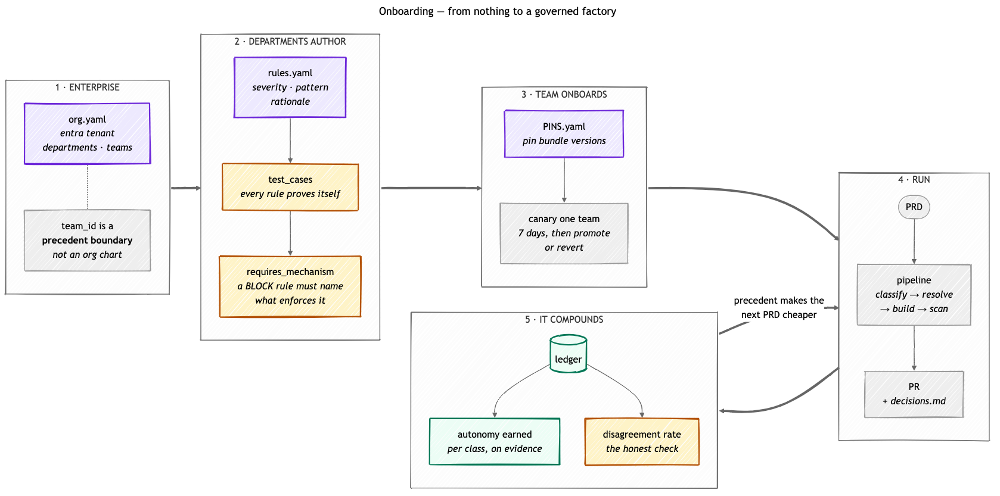

# Onboarding and daily operation

How an organization gets from nothing to a governed agent factory, and what an
operator actually does with the dashboard once it is running.

This document describes the system as built. Where a mechanism does not exist
yet it is marked **[not built]** rather than described in the present tense.

---

## Part 1 — The shape of the thing

Four planes. Every AI decision passes through all four, and the Ledger is what
makes the other three auditable.


Read it in two movements. **Left to right** is one run: a PRD becomes typed
ambiguity cards, each card is either auto-resolved from precedent or gated to a
human, code is generated, and the review gate either refuses it against a BLOCK
rule or lets it through to a PR.

**The two arrows coming back** are where the value is:

- **⚡ Fast loop** — a human ruling becomes precedent, and the next run needs one
  fewer human. Measured in runs.
- **🕰 Slow loop** — drift becomes a standards change, committee-approved and
  canaried. Measured in weeks.

The product is not code generation. It is that six weeks in you can answer
*"why does our software look like this?"* with rows instead of recollection.

> Diagram sources live in `docs/diagrams/*.mmd` (Mermaid). Re-render with:
> `npx @mermaid-js/mermaid-cli -i docs/diagrams/four-planes.mmd -o docs/diagrams/four-planes.png -b white -w 1600`

---

## Part 2 — Onboarding



Five steps. The first three are set up once; the last two are the loop you live
in afterwards.

### Step 1 — Enterprise: the identity spine

The organization model defines departments, teams, cost centers, and the Entra
tenant they map to. It is loaded from `org.yaml`
(`ORG_MODEL_PATH` env, or `./org.yaml`).

```yaml
identity:
  entra_tenant_id: <tenant-guid>
departments:
  - id: clinical-platform
    cost_center: CC-4410
teams:
  - id: team-cardiology
    department: clinical-platform
    m365_group: cardiology-eng@example.com
    cost_center: CC-4410
```

**Why this exists.** `team_id` is the Cosmos partition key for the entire
decision ledger. It is not an org chart — it is a **precedent boundary**: which
past rulings the agent may reuse. Two GitHub teams can share one boundary if
their rulings should inform each other; one GitHub team may need two boundaries
if its sandbox precedent must never reach production.

> **Current state.** No `org.yaml` is present in this repo, so the orchestrator
> runs in **permissive bootstrap mode** — any `team_id` string is accepted and
> silently creates a new partition. Once an org model IS loaded, a run naming an
> unknown team is **rejected** (`UnknownTeamError`), not written anonymously.
> Authoring `org.yaml` is what turns that enforcement on.

**Team ids are normalized.** `canonical_team_id()` forces `team-<slug>`. A UI
submitting `cardiology` while a token is scoped to `team-cardiology` writes to
one partition and reads from another — the decisions view goes silently empty.
Do not hand-write team ids in two places.

### Step 2 — Departments author bundles

Bundles are authored **once per department**, not per team.

```
standards-bundles/
  security/v0.1.0/rules.yaml     ← authored by @security-leadership
  security/v0.2.0/rules.yaml     ← proposed, awaiting approval
  privacy/v0.1.0/rules.yaml
  architect/v0.1.0/rules.yaml
  finops/v0.1.0/rules.yaml
  PINS.yaml                      ← which team is on which version
```

Each rule declares severity, enforcement surface, rationale, and test cases:

```yaml
- id: PHI-001
  title: Patient identifiers may not appear in cleartext logs
  phi_locked: true            # invariant — can never be auto-resolved
  severity: BLOCK
  enforcement:
    pipeline_stages: [codegen, review-scan]
  pattern: '...'
  test_cases:
    - input: "logger.info(f'patient {mrn} updated')"
      expect: BLOCK
```

**Two rules about rules, both learned the hard way:**

1. **Every rule must pass its own `test_cases`.** When `security/v0.2.0` was
   drafted, 3 of 7 new regexes failed their own fixtures — they read perfectly
   and matched nothing. A rule that fails its fixtures is worse than no rule,
   because it reports enforcement it does not perform.

2. **Every BLOCK rule must declare a mechanism.** `SBOM-001` shipped in v0.1.0
   as BLOCK with no scanner behind it; the review stage reported `findings: 0`
   because nothing was ever scanned. v0.2.0 adds `requires_mechanism` and
   `.github/workflows/supply-chain-scan.yml` supplies one. A missing or
   unreadable scan report **fails the build** — it is never treated as a pass.

**Changing a bundle is governed, never direct.** Author a new version, open an
OpenSpec change proposal, get roster approval, then roll pins. See
`openspec/changes/add-security-bundle-v0.2.0/` for a worked example.

### Step 3 — Team: pin versions and set the boundary

```yaml
# PINS.yaml
defaults:
  security: v0.1.0
  privacy: v0.1.0
teams:
  team-cardiology:
    security: v0.1.0        # move to v0.2.0 to canary
```

**Canary rollout** is the intended path for any bundle change: pin one team to
the new version for 7 days, watch block-rate and false-positive metrics, then
auto-PR to promote all teams or revert.

> **[not built]** Per-team delivery repos. Every team currently delivers PRs to
> the single `DELIVER_TARGET_REPO`. Nothing prevents one team's generated code
> from landing in another's repo.

> **[not built]** A `/teams` admin page. Team onboarding today means editing
> `org.yaml` and `PINS.yaml` by hand. The UI's team picker is a hardcoded array
> in `runs/new/page.tsx` and must be kept in sync manually.

### Step 4 — Drop a PRD

The PRD does not ground the build directly. It is **classified first**:

```
PRD ──▶ ASSESS ──▶ typed ambiguity cards
                   scope-resolution · phi-classification · sla-binding
                   auth-policy · identifier-format · data-retention
                          │
                          ▼
                     RESOLVE
              ┌───────────┴───────────┐
              ▼                       ▼
     autopilot (precedent      GATE to a human
     + confidence ≥ pin)       (always, for invariants)
```

**Invariants can never be autopiloted.** On live data `phi-classification`
appears 38 times and **every single one was resolved by a human — 0 by the
agent**. That is the compliance story, and it is measured, not asserted.

### Step 5 — The pipeline runs

```
ASSESS → RESOLVE → ARCHITECT → CODEGEN → REVIEW-SCAN → DELIVER
                                              │
                                    fail-hard gate:
                                    bundle BLOCK rules
                                    + supply-chain scan
```

Delivery opens a PR carrying five artifacts:

```
decisions.md          ← the audit trail, links back to the ledger
docs/architecture.md
docs/test-plan.md
src/...
tests/...
```

### Step 6 — The loop closes

This is where the value compounds, and there are **two loops at two speeds**:

| | Fast loop — *learning* | Slow loop — *legislating* |
|---|---|---|
| **Trigger** | A human rules on a card | Doctor detects drift |
| **Effect** | That class earns autonomy | Bundle `v0.1.0 → v0.2.0` |
| **Speed** | Next run | Committee + canary week |
| **Surface** | Lineage graph | Changes page + PINS |

Every decision becomes precedent for the next PRD **from that team**. A flag
retracts precedent — that is the correction path.

---

## Part 3 — Working the dashboard

### The daily loop is three queues, in order

**1. Blocked gates — "Needs you"**
The agent is stopped, waiting on a person. Minutes matter; this is throughput.
Work it first, every day.

**2. Flags from yesterday**
A human marked a decision wrong. Each flag retracts precedent and stops it being
quoted back by `findPrecedent`. This is the highest-value input the system
receives — it is how the factory learns it was wrong.

**3. Drift**
Cost per decision, gate rate, disagreement rate trending the wrong way.

Everything else is a dashboard nobody should open daily.

### Reading failed runs correctly

**This is the most misread number in the product.** A failed run is one of two
opposite things:

| | What it means | What to do |
|---|---|---|
| **Blocked by policy** | A BLOCK rule refused the code. The guardrail worked. | Read the cited rule. Fix the code, or challenge the rule via a standards change. |
| **Technical failure** | Something actually broke. | Investigate. This is a defect. |

On live data, a typical block reads:

```
Policy gate FAILED — 38 blocker(s): [security/v0.1.0/PHI-001]
```

That is an agent writing patient identifiers into logs and being refused at the
gate. It is evidence the system works — not an outage.

> **Current state.** `/api/runs` now classifies failures (`failure_kind`,
> `blocking_rules`, `blocker_count`). The dashboard KPI does **not yet split
> them** and still shows a single "failed" count. Until it does, read the
> per-run detail before drawing a conclusion from the headline number.

### The metric that keeps you honest

**Autonomy earned** — the share of decisions resolved without a human — measures
how much the agent was *allowed* to do. It is not evidence it should have been.

The number that grounds it is the **disagreement rate**: when the agent acted
alone, how often did it diverge from a human ruling on the same question?

```bash
python3 -m pytest apps/orchestrator/tests/test_replay.py
```

Replay pairs each human ruling with autopilot decisions on the same `card_id`:

| Verdict | Meaning |
|---|---|
| `AUTONOMY EARNED` | Zero disagreements over a sufficient sample |
| `AUTONOMY DEFENSIBLE` | At or under the class ceiling |
| `REVOKE AUTONOMY` | Above ceiling — acting alone and getting it wrong |
| `INVARIANT — HUMAN ALWAYS` | Never eligible, regardless of score |
| `INSUFFICIENT` | Too few samples — **no rate is reported** |
| `UNSCORED` | Outcome unknown — excluded, never counted as agreement |

**A rising autonomy % with a rising disagreement rate is the failure mode that
looks like success on every chart.** Watch them together.

Thresholds come from the pinned bundle, not from code — so changing one is a
bundle change with a canary, not a deploy.

### Weekly and monthly

- **Weekly** — promote or demote classes on replay evidence. Review flags.
- **Monthly** — bundle version bump through the committee; canary one team for a
  week; promote or revert.

---

## Part 4 — Honest limits

State these before a demo, not after:

- **Delivery ends at `Delivery blocked — synthetic provider output`.** The
  pipeline demos correctly through gates into the ledger; end-to-end delivery to
  a real repo is not wired for every path.
- **No verified identity.** `AUTH_MODE=entra` deliberately refuses rather than
  fake JWT validation, and EasyAuth is off. Any caller can claim any `team_id`.
  Team boundaries are advisory until this is closed.
- **`accuracy_score` is never computed** — `0.0` on every ledger entry. Replay
  reports such entries as `UNSCORED` rather than assuming agreement.
- **`slot_value_hash` is class-level, not slot-level.** All 18 distinct values
  map 1:1 onto ambiguity classes. Precedent and replay key on `card_id`.
  Anything bucketing on `slot_value_hash` is grouping a whole class, not a chain.
- **The PR review loop store is empty** (`/api/review-loops` → `{"items":[]}`).
  Autonomy governance is a separate, real mechanism — do not conflate them.

---

## Reference

| Topic | Path |
|---|---|
| Bundle schema | `standards-bundles/BUNDLE-SCHEMA.md` |
| Bundle pins | `standards-bundles/PINS.yaml` |
| Replay metric | `openspec/changes/add-replay-disagreement-metric/` |
| Security v0.2.0 | `openspec/changes/add-security-bundle-v0.2.0/` |
| Agent personas | `.github/agents/` |
| Standards hierarchy | `AGENTS.md` |
